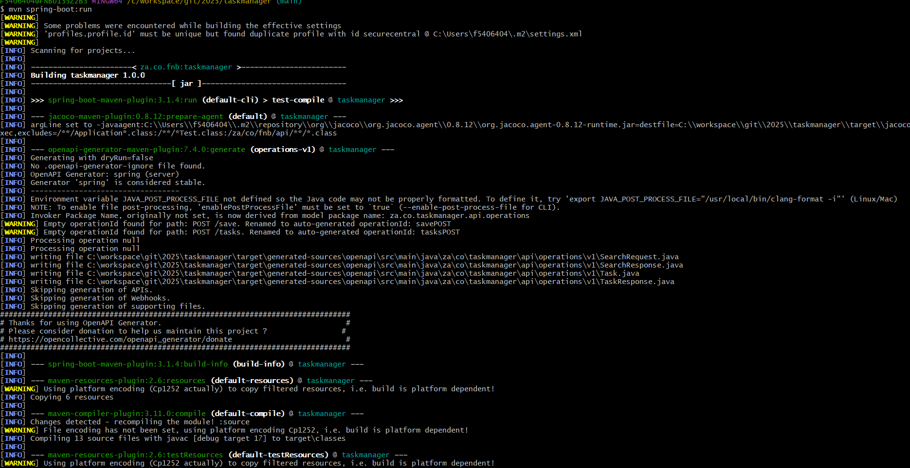
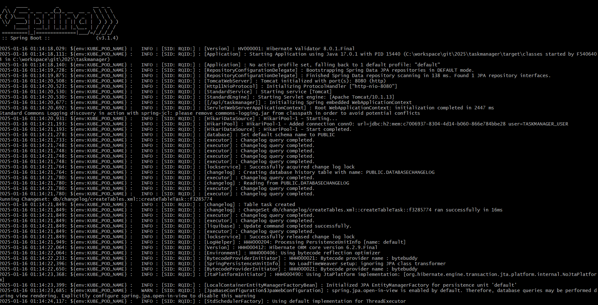
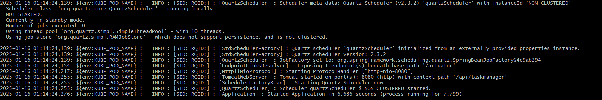

## Rest API Task Management

###How to run the project

- Install JDK 17+
- Install maven ```https://maven.apache.org/install.html```
- Make sure your JAVA_HOME is set
- Run ```mvn clean install && mvn spring-boot:run``` to start the backend application
- Time taken to complete the task: 3hrs





### API partly document ``OperationsV1``